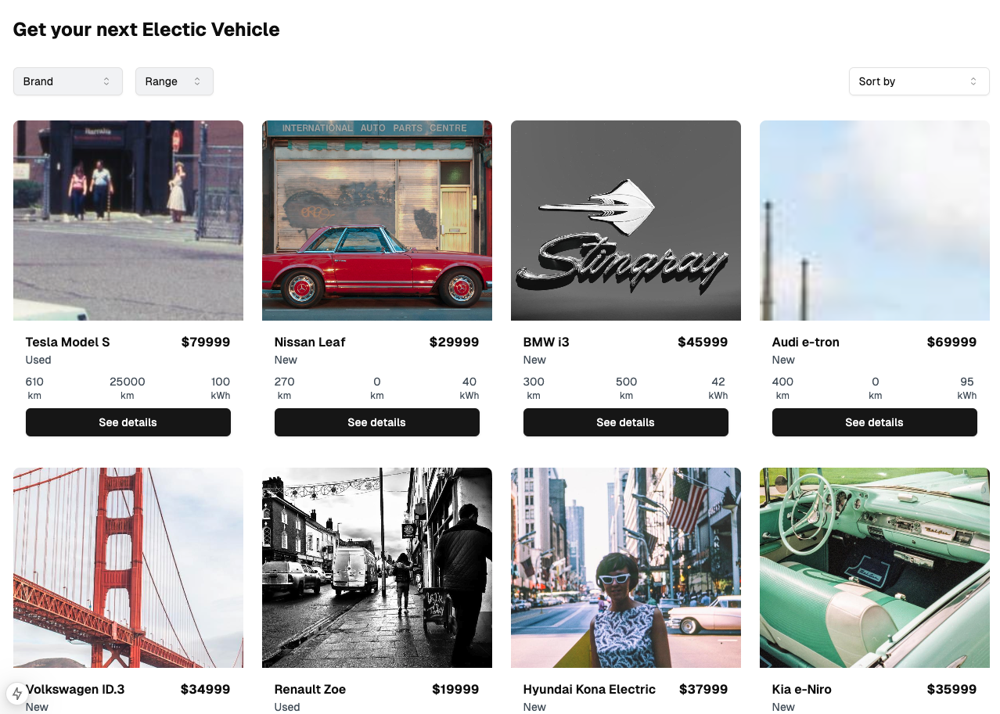

# EV Listing App

To start this app for development:

- Run `npm install`
- Copy `.env.example` to `.env`
- Run `npm run db:init`
- Run `npm run db:push`
- Run `npm run seed`
- Run `npm run dev`

Deploy docker image to AWS:

- see Notion

